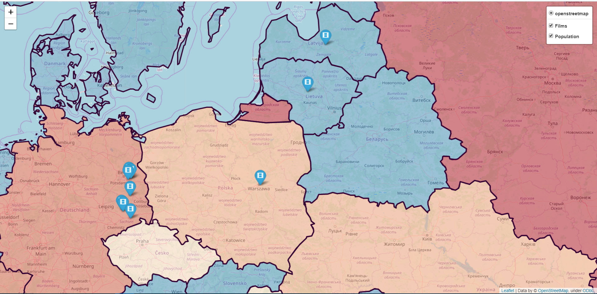
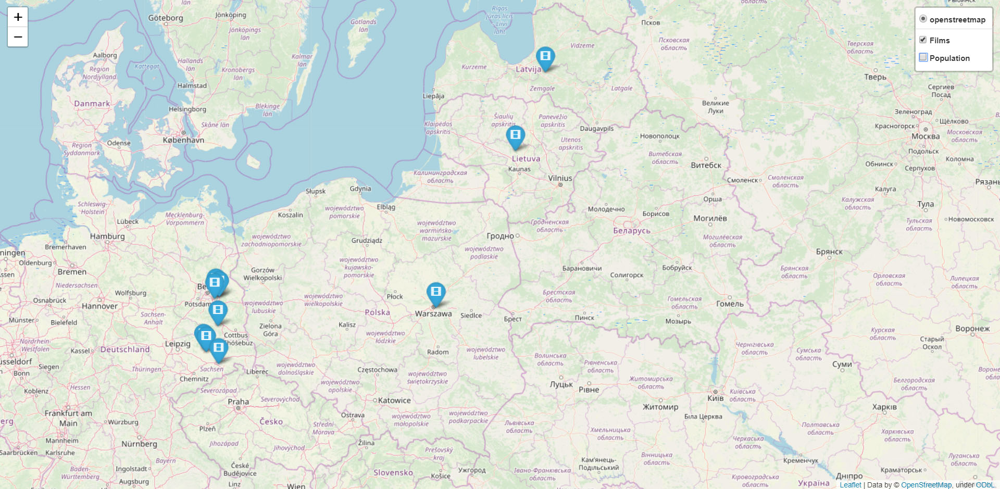
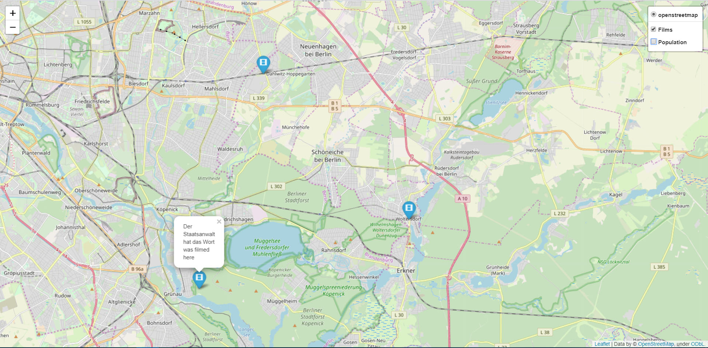

# web_map
## Description
    This project generates a map with two layers. 
    User inputs their coordinates and the year they want to get information about.
    First one - 'Films' - the layer includes 10 markers put on the places where the films were filmed.
    Second one - 'Population' - is using 'world.json' to get the information about countries and their population. Countries that are colored blue and light-blue have the population that is less than 10 mil and 25 mil accordingly. Yellow - less than 50 mil. Orange - less than 100 mil. Red - more than 100 mil.

## Requirements
```pip install folium```

```pip install geopy```

```pip install pandas```

## Example of execution

```Please enter a year you would like to have a map for: 1965```

```Please enter your location (format: lat, long): 49.842957,24.031111```

```generating map...```

```adding marks...```

```adding population...```

```map generated. please take a look at "Map.html"```
## Screenshots
### map with both layers

### map with only the 'Films' layer active

### displayed message: name of the movie that was filmed there


## HTML
```<!DOCTYPE html> ```- an instruction to the web browser about what version of HTML the page is written in.

```<head>``` - contains all the head elements.

```<script>``` - contains scripting statements.

```<style>``` - defines style information for HTML document.

```<body>``` - defines the documents body.

